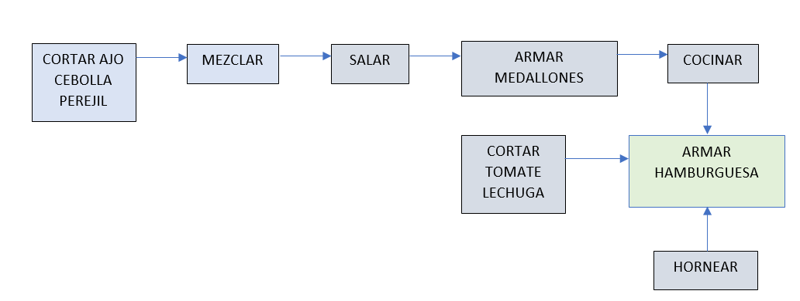

# Sistemas Operativos y Redes

## Trabajo Práctico de hilos y semáforos

En la cocina de Hell’s Burgers compiten tres equipos de 
cocineros. 
La dificultad de la competencia es que la cocina no cuenta
con el equipamiento individual para cada equipo, sino que
algunos de ellos son compartidos. Por lo tanto es necesario una organizacion para
cumplir con el objetivo.

## Implementación:
La simulación se programo en lenguaje C con la utilización de hilos y semáforos. el objetivo, sumiluar un paralelismo y
una correcta organizacioón de los 3 equipos. 
 Se crearon 3 hilos, es decir uno por equipo, y cada hilo a su vez crea otro por cada acción. Estos mismos serán organizados por semáforos.
habra semáforos mutex que organicen la utilización de los recursos compartidos y semáforos particulares que organicen el paso a paso de cada
equipo en particular.

## Explicación en pseudocódigo:
main{
   
  &nbsp; HILO EQUIPO 1(EJECUTAR RECETA);
   
  &nbsp; HILO EQUIPO 2(EJECUTAR RECETA);     &nbsp; &nbsp;  //TODO LOS HILOS EJECUTAN LA MISMA FUNCION.
   
  &nbsp; HILO EQUIPO 2(EJECUTAR RECETA);
   
   
  //SEMAFOROS COMPARTIDOS:
   
 &nbsp;   SEMAFOROCOMPARTIDO_SAL 1
   
 &nbsp;   SEMAFOROCOMPARTIDO_PLANCHA 1
   
 &nbsp;  SEMAFOROCOMPARTIDO_HORNO 1
    
}
  
  
*EJECUTAR RECETA*{
     
    &nbsp; HILO (HORNEAR);
     
    &nbsp; HILO (CORTAR CEBOLLA AJO PEREJIL);
     
    &nbsp; HILO (CORTAR EXTRAS);
     
    &nbsp; HILO (MEZCLAR)
     
    &nbsp; HILO (SALAR)
     
    &nbsp; HILO(ARMAR MEDALLON);
     
    &nbsp;  HILO (COCINAR);
     
    &nbsp; HILO (ARMAR HAMBURGUESA);
     
     
    //SEMAFOROS PARTICULARES POR EQUIPO COMIENZAN TODOS APAGADOS
     
   &nbsp; SEMAFORO_MEZCLAR 0
     
   &nbsp; SEMAFORO_SALAR 0
     
   &nbsp; SEMAFORO_ARMAR MEDALLON 0
     
   &nbsp; SEMAFORO_COCINAR 0
     
   &nbsp; SEMAFORO_ARMAR HAMBURGUESA 0
     
   &nbsp; SEMAFORO_EXTRAS CORTADOS 0
     
  &nbsp;  SEMAFORO_PAN HORNEADO 0
     
}
 
 
**HORNEAR()**{
 
&nbsp;&nbsp; *P(SEMAFOROCOMPARTIDO_HORNO)* //CHEQUEA QUE OTRO EQUIPO NO LO ESTE USANDO, EN ESE CASO LO DESCUENTA EN UNO PARA QUE OTRO EQUIPO NO ENTRE
   
&nbsp;&nbsp; *V(SEMAFORO_PAN HORNEADO)*  //NECESARIO SABER ANTES DE ARMAR LA HAMBURGUESA //COMO NO DEPENDE OTRA ACCION SOLO SE EJECUTA Y HABILITA EL PASO QUE SIGUE
   
&nbsp;&nbsp; *V(SEMAFOROCOMPARTIDO_HORNO*//SUMA UNO AL SEMAFORO, ES DECIR, LO HABILITA PARA QUE OTRO EQUIPO LO USE.
 
}
 
 
**CORTAR CEBOLLA AJO PEREJIL()**{
 
&nbsp;&nbsp; *V(SEMAFORO_MEZCLAR)*    //COMO NO DEPENDE OTRA ACCION SOLO SE EJECUTA Y HABILITA EL PASO QUE SIGUE
 
}
 
 
**CORTAR EXTRAS()**{
 
&nbsp;&nbsp; *V(SEMAFORO_EXTRAS CORTADOS)* //NECESARIO SABER ANTES DE ARMAR LA HAMBURGUESA //COMO NO DEPENDE OTRA ACCION SOLO SE EJECUTA Y HABILITA EL PASO QUE SIGUE
 
}
 
 
**MEZLCAR()**{
 
&nbsp; &nbsp;*P(SEMAFORO_MEZCLAR)* // PREGUNTA QUE EL PASO ANTERIOR SE HAYA HECHO
 
&nbsp; &nbsp;*V(SEMAFORO_SALAR)* // HABILITA LA ACCIÓN QUE SIGUE
 
}
 
 
**SALAR()**{
 
&nbsp;&nbsp; *P(SEMAFOROCOMPARTIDO_SAL)* //PREGUNTA QUE OTRO EQUIPO NO LO ESTE USANDO, EN ESE CASO LO DESCUENTA EN UNO PARA QUE OTRO EQUIPO NO ENTRE
 
&nbsp;&nbsp; *P(SEMAFORO_SALAR)* // PREGUNTA QUE EL PASO ANTERIOR SE HAYA HECHO
 
&nbsp;&nbsp; *V(SEMAFORO_ARMAR MEDALLON)* // HABILITA LA ACCIÓN QUE SIGUE
 
&nbsp;&nbsp; *V(SEMAFOROCOMPARTIDO_SAL)* //SUMA UNO AL SEMÁFORO, ES DECIR, LO HABILITA PARA QUE OTRO EQUIPO LO USE.
 
}
 
 
**ARMAR MEDALLON()**{
 
&nbsp;&nbsp;*P(SEMAFORO_ARMAR MEDALLON)* // PREGUNTA QUE EL PASO ANTERIOR SE HAYA ACTIVADO ESTE SEMÁFORO
 
&nbsp;&nbsp;*V(SEMAFORO_COCINAR)* // HABILITA LA ACCIÓN QUE SIGUE
 
}
 
 
**COCINAR()**{
 
&nbsp;&nbsp; *P(SEMAFOROCOMPARTIDO_PLANCHA)* //PREGUNTA QUE OTRO EQUIPO NO LO ESTE USANDO, EN ESE CASO LO DESCUENTA EN UNO PARA QUE OTRO EQUIPO NO ENTRE
 
&nbsp;&nbsp; *P(SEMAFORO_COCINAR)* // PREGUNTA QUE EL PASO ANTERIOR SE HAYA ACTIVADO ESTE SEMÁFORO
 
&nbsp;&nbsp;*V(SEMAFORO_ARMAR HAMBURGUESA)* // HABILITA LA ACCIÓN QUE SIGUE
 
&nbsp;&nbsp; *V(SEMAFOROCOMPARTIDO_PLANCHA)* //SUMA UNO AL SEMÁFORO, ES DECIR, LO HABILITA PARA QUE OTRO EQUIPO LO USE.
 
}
 
 
**ARMAR HAMBURGUESA()**{
 
&nbsp;&nbsp; *P(SEMAFORO_ARMAR HAMBURGUESA)* // PREGUNTA QUE EL PASO ANTERIOR SE HAYA ACTIVADO ESTE SEMÁFORO
 
&nbsp;&nbsp; *P(PAN HORNEADO)* // PREGUNTA QUE EL PASO ANTERIOR SE HAYA ACTIVADO ESTE SEMÁFORO
 
&nbsp;&nbsp; *P(EXTRAS CORTADOS)* // PREGUNTA QUE EL PASO ANTERIOR SE HAYA ACTIVADO ESTE SEMAFORO
 
}
 
### En la siguiente imágen se indican con flechas la secuencia que se lleva a cabo en el pseudocódigo
 

 

### Prueba de escritorio
 

### Conclusión:
En sintesis la utilización de semaforos en conjunto de hilos se presta como una gran herramienta para el desarrollo de software. Si bien a primera vista no es una herramienta 
sencilla de utilizar pues, diversos inconvenientos se presentaron durante la relalización del trabajo. la realidad es que con una correcta busqueda de informacion las posibilidades de su aprendizaje y aprovechamiento son enormes. 

